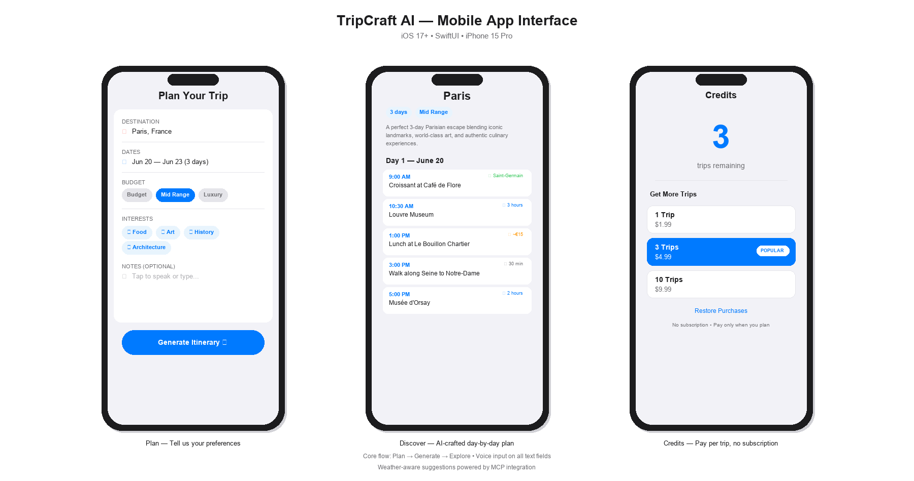
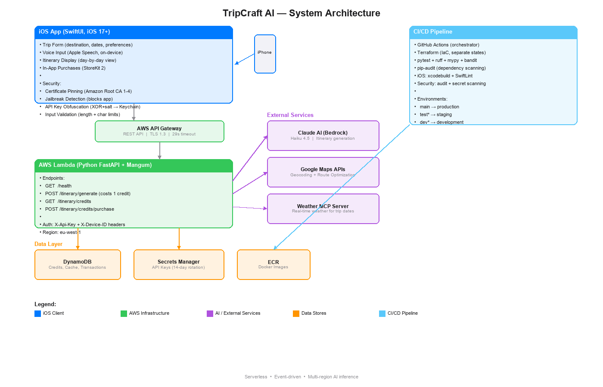

<div align="center">

# ✈️ TripCraft AI

### Your Personal AI Travel Planner

*Tell it where you want to go. Get a handcrafted, day-by-day itinerary in seconds.*

[](https://developer.apple.com/ios/)
[](https://swift.org)
[](https://python.org)
[](https://aws.amazon.com/lambda/)
[](https://www.terraform.io)
[](https://www.anthropic.com)

</div>

---

## 🎯 What is TripCraft AI?

TripCraft AI is an iOS app that generates **personalized travel itineraries** powered by Claude AI. No generic blog posts, no hours of research — just tell the app your destination, dates, budget, and interests, and get a complete trip plan with:

- 🗓️ **Day-by-day schedules** with optimized walking routes
- 🍽️ **Restaurant recommendations** matched to your dietary needs
- 🏨 **Hotel suggestions** by neighborhood and price range
- 🎒 **Packing tips** tailored to your destination and weather
- 💰 **Cost estimates** so you know what to budget
- 🎤 **Voice input** — speak your preferences instead of typing
- 🌤️ **Weather-aware planning** via MCP integration

---

## 📱 App Interface

<p align="center">
  
</p>

> **Three screens, one flow**: Plan your trip → Get an AI-crafted itinerary → Manage credits. Voice input available on all text fields. No subscriptions — pay only when you plan.

---

## 🏗️ Architecture

<p align="center">
  
</p>

> Fully serverless on AWS. The iOS app talks to API Gateway → Lambda → Bedrock (Claude AI) + Google Maps for route optimization. Weather data provided via MCP server for real-time trip planning.

---

## ⚡ How It Works

```
┌─────────────┐     ┌──────────────┐     ┌─────────────────┐     ┌──────────────┐
│  📱 iPhone  │────▶│  API Gateway │────▶│  Lambda (FastAPI)│────▶│  Claude AI   │
│  (SwiftUI)  │◀────│  (TLS 1.3)  │◀────│  + Mangum       │◀────│  (Bedrock)   │
└─────────────┘     └──────────────┘     └────────┬────────┘     └──────────────┘
                                                   │
                                          ┌────────┼────────┐
                                          ▼        ▼        ▼
                                     DynamoDB  Google    Weather
                                     (credits  Maps     MCP Server
                                      + cache) (routes)
```

1. **You plan** — Pick destination, dates, budget level, pace, interests, and dietary preferences
2. **AI generates** — Claude Haiku 4.5 crafts a detailed itinerary based on your preferences
3. **Routes optimize** — Google Maps API reorders activities for efficient walking routes
4. **Weather adapts** — MCP server provides real-time weather data for smart scheduling
5. **You explore** — Day-by-day breakdown with times, locations, costs, and durations

---

## 🛡️ Security

TripCraft AI is built with security as a first-class concern:

| Layer | Protection |
|-------|-----------|
| **Network** | TLS 1.3 only, certificate pinning (Amazon Root CA 1-4) |
| **API Keys** | XOR+salt obfuscation → Keychain storage → memory wipe |
| **Device** | Jailbreak detection (file checks + DYLD injection + writable paths) |
| **Input** | Length limits, forbidden char filtering, prompt injection sanitization |
| **Backend** | HMAC timing-safe auth, 14-day auto-rotating secrets |
| **Payments** | StoreKit 2 with transaction replay prevention (DynamoDB conditional writes) |

---

## 💳 Pricing

| Package | Credits | Price |
|---------|---------|-------|
| Single Trip | 1 | $1.99 |
| **Explorer Pack** | 3 | **$4.99** |
| Globetrotter | 10 | $9.99 |

> **1 free trip** on first use. No subscriptions. Cache hits don't consume credits.

---

## 🧰 Tech Stack

| Layer | Technology |
|-------|-----------|
| **iOS App** | SwiftUI • iOS 17+ • StoreKit 2 • Apple Speech • MVVM |
| **Backend** | Python FastAPI • Mangum (Lambda adapter) • Pydantic |
| **AI** | Claude Haiku 4.5 via AWS Bedrock (eu-west-1, cross-region) |
| **Maps** | Google Maps Geocoding + Routes API (walking optimization) |
| **Weather** | MCP Server (real-time weather data for trip dates) |
| **Database** | DynamoDB (credits, cache, transactions) |
| **Infra** | AWS Lambda • API Gateway (REST) • ECR • Secrets Manager |
| **IaC** | Terraform (2 root modules with separate S3 state) |
| **CI/CD** | GitHub Actions (orchestrator + reusable workflows) |
| **Security** | bandit • pip-audit • SwiftLint • secret scanning |

---

## 📂 Project Structure

```
├── ios/                        SwiftUI app (iOS 17+)
│   └── AISuggestionApp/
│       ├── App/                Entry point, config
│       ├── Models/             Codable request/response types
│       ├── Services/           API client, Keychain, StoreKit, Speech
│       ├── ViewModels/         Trip form + credits logic
│       ├── Views/              SwiftUI screens + reusable components
│       └── Utilities/          Security (obfuscation, pinning, jailbreak)
│
├── backend/                    Python serverless backend
│   ├── src/app/
│   │   ├── models/             Pydantic schemas (request, response, itinerary)
│   │   ├── routers/            FastAPI route handlers
│   │   ├── services/           Claude, credits, cache, route optimizer
│   │   ├── prompts/            System prompt + templates
│   │   └── middleware/         API key validation
│   ├── infrastructure/
│   │   └── terraform/          IaC (Lambda, API GW, DynamoDB, IAM)
│   └── tests/                  pytest suite
│
├── .github/workflows/          CI/CD pipeline
├── pics/                       Architecture + UI diagrams
└── scripts/                    Diagram generators
```

---

## 🚀 Getting Started

### Backend

```bash
cd backend
uv sync                         # Install dependencies
cp .env.example .env            # Configure AWS + Google Maps keys
uv run uvicorn src.app.main:app --reload  # Local dev server
uv run python -m pytest         # Run tests
```

### iOS

```bash
cd ios
open AISuggestionApp.xcodeproj  # Open in Xcode
# Build: ⌘B | Run: ⌘R | Test: ⌘U
```

> Requires Xcode 16+ and macOS. Set your API base URL in `AppConfiguration.swift`.

---

## 🔌 API Endpoints

| Method | Path | Auth | Description |
|--------|------|------|-------------|
| `GET` | `/health` | None | Health check |
| `POST` | `/itinerary/generate` | API Key + Device ID | Generate trip itinerary (1 credit) |
| `GET` | `/itinerary/credits` | API Key + Device ID | Check credit balance |
| `POST` | `/itinerary/credits/purchase` | API Key + Device ID | Add credits after IAP |

### Required Headers
```
X-Api-Key: <rotated secret from AWS Secrets Manager>
X-Device-ID: <8-128 char device identifier>
Content-Type: application/json
```

---

## 🌤️ Weather MCP Integration

TripCraft AI uses an MCP (Model Context Protocol) server to provide real-time weather data:

- Fetches weather forecasts for the destination during trip dates
- AI adjusts activity suggestions based on weather conditions
- Indoor alternatives suggested for rainy days
- Optimal times for outdoor activities based on temperature and conditions

---

## 🔄 CI/CD Pipeline

```
Setup → Test + Security + iOS Build → Initialize → ECR + Docker → Terraform Plan → Deploy
```

| Stage | What it does |
|-------|-------------|
| **Test** | pytest + ruff + mypy |
| **Security** | pip-audit + bandit + secret scanning |
| **iOS** | xcodebuild + SwiftLint + security audit |
| **Deploy** | Docker → ECR → Terraform apply → Lambda update |

---

## 📄 License

Private project. All rights reserved.

---

<div align="center">

**Built with ❤️ using Claude AI, SwiftUI, and AWS**

*TripCraft AI — Because every great trip starts with a great plan.*

</div>
